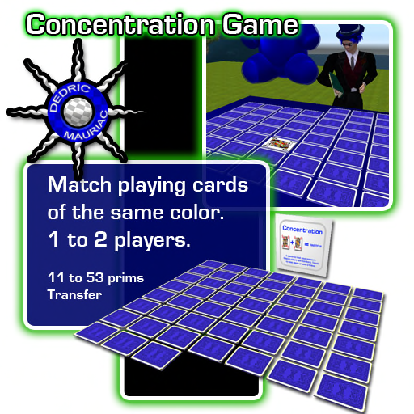

# Concentration Game

Match playing cards of the same color and value. 

This card game is based on a childrens game of memory. It can be played by one or two players. Cards are shuffled and then laid out face down. Players choose two cards that they think will make a match. If the color and value matches, then they remove the cards and take another turn. In a two player game, the next player gets to take a turn when the first player is unable to make a match.

To start a one player game, the player touches the game panel twice. To start a two player game, each person touches on the game panel. The number of matches that each person makes is recorded. The person with the most matches at the end of the game wins. A game ends when all cards are matched, or 30 minutes have passed. 

The game works within the alloted prims available. If the parcel has less then 52 prims available, the game will use less cards. It needs at least 10 prims to be available or it will not let a game begin.

# Assembly

## Playing Card

 1. Create a prim
 1. Drop the following objects into the prim to create a card
   1. Playing Card.png
   1. Playing Card.logic.lsl
 1. Add Playing Card.prim.lsl
 2. Delete Playing Card.prim.lsl after it runs

## Game

 1. Drop the following items into a new prim to create the game
   1. Game.png
   1. Game.logic.lsl
   1. The **Playing Card** object
 1. Add Game.prim.lsl
 2. Delete Game.prim.lsl after it runs

Prims: 11 to 53
